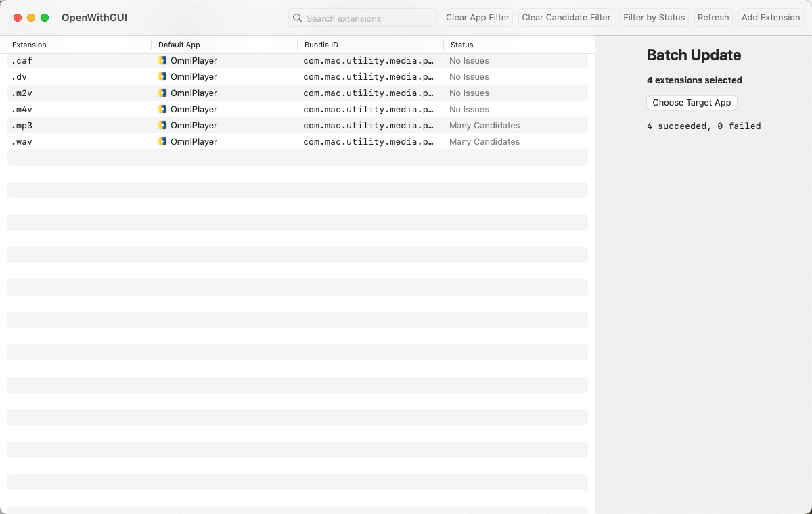

# OpenWithGUI

OpenWithGUI 是一个 macOS 桌面应用，用来集中查看和修改“文件扩展名 -> 默认打开应用”的关联关系。

相比 Finder 里繁琐的 `显示简介 -> 打开方式 -> 全部更改...` 操作，OpenWithGUI 更像一个表格管理器：把系统当前状态一次性展示出来，并支持批量修改。

[English README](README.md)

## 界面截图



## 主要功能

- 用一张表集中展示扩展名和默认应用的映射关系。
- 显示每个扩展名当前的默认应用、Bundle ID 和状态。
- 支持按默认应用筛选，快速查看某个 app 绑定了哪些扩展名。
- 支持按 Candidate App 筛选，快速查看某个 app 声明自己可以打开哪些扩展名。
- **支持筛选某个应用支持的全部文件扩展名，并批量更改这些格式的默认打开应用。**
- 支持按状态筛选。
- 搜索框仅搜索扩展名，结果更稳定清晰。
- 支持多选后统一改成同一个应用。
- 修改单个扩展名时，会展示 Candidate Apps 供选择。
- 支持手动添加扩展名，也支持删除用户自己添加的扩展名。

## 运行要求

- macOS 14 及以上
- 使用打包好的 `.app` 或 `.dmg` 时，不需要安装 Swift 或 Xcode

## 从 DMG 安装

下载或打开 DMG 后，将 `OpenWithGUI.app` 拖入 `Applications` 即可。

如果 macOS 因“未认证开发者”拦截应用，请手动放行：

1. 先把 `OpenWithGUI.app` 拖到 `Applications`
2. 在 Finder 中右键 `OpenWithGUI.app`
3. 点击“打开”
4. 在二次确认弹窗中再次点击“打开”

如果系统在“系统设置 -> 隐私与安全性”中出现安全提示，也可以在那里手动允许。

## 这个项目要解决什么问题

macOS 上默认应用管理一直很别扭：

- 一次通常只能改一个扩展名。
- 系统没有统一的总览面板。
- 很难快速看出某个扩展名当前到底由哪个 app 接管。
- 很难查看某个应用支持的全部格式并批量更改。
- 某些应用会注册过多关联，留下混乱状态。

OpenWithGUI 的目标，就是把这些关联关系直接可视化，并提供更直接的修改方式，不需要反复点 Finder，也不需要记复杂的 bundle ID。

## License

本项目使用 [MIT License](LICENSE)。

## 此 Fork 重大更新

- **按应用筛选并批量更改**：现在可以筛选某个应用支持的全部文件扩展名，然后多选这些扩展名并批量更改它们的默认打开应用。

## 同类项目推荐

- [ColeMei/openwith](https://github.com/ColeMei/openwith) - 一个基于 Rust 的 TUI 项目，可以在终端里管理 macOS 文件扩展名关联。
- [Run1997/OpenWith-GUI](https://github.com/Run1997/OpenWith-GUI) - 一个基于 SwiftUI 的 macOS 默认应用管理工具，功能类似。

## 从源码编译

### 环境要求

- macOS 14 及以上
- Swift 6.0 及以上（随 Xcode 16 或 Command Line Tools 安装）

### 编译步骤

1. 克隆仓库：
```bash
git clone https://github.com/RayMorTwinkle/OpenWith_Panel.git
cd OpenWith_Panel
```

2. 编译项目：
```bash
swift build -c release --disable-sandbox
```

3. 打包应用：
```bash
# 创建应用包目录结构
mkdir -p dist/OpenWithGUI.app/Contents/MacOS
cp .build/arm64-apple-macosx/release/OpenWithGUI dist/OpenWithGUI.app/Contents/MacOS/
chmod +x dist/OpenWithGUI.app/Contents/MacOS/OpenWithGUI

# 复制资源文件
mkdir -p dist/OpenWithGUI.app/Contents/Resources
cp Assets/AppIcon.icns dist/OpenWithGUI.app/Contents/Resources/

# 创建 Info.plist
cat > dist/OpenWithGUI.app/Contents/Info.plist << 'EOF'
<?xml version="1.0" encoding="UTF-8"?>
<!DOCTYPE plist PUBLIC "-//Apple//DTD PLIST 1.0//EN" "http://www.apple.com/DTDs/PropertyList-1.0.dtd">
<plist version="1.0">
<dict>
    <key>CFBundleExecutable</key>
    <string>OpenWithGUI</string>
    <key>CFBundleIdentifier</key>
    <string>com.openwithgui.app</string>
    <key>CFBundleName</key>
    <string>OpenWithGUI</string>
    <key>CFBundlePackageType</key>
    <string>APPL</string>
    <key>CFBundleShortVersionString</key>
    <string>0.2.0</string>
    <key>LSMinimumSystemVersion</key>
    <string>14.0</string>
</dict>
</plist>
EOF

# 签名应用
codesign --force --deep -s - dist/OpenWithGUI.app
```

4. 创建 DMG（可选）：
```bash
mkdir -p dist/.dmg-staging
cp -R dist/OpenWithGUI.app dist/.dmg-staging/
ln -s /Applications dist/.dmg-staging/Applications
hdiutil create -volname "OpenWithGUI" -srcfolder dist/.dmg-staging -ov -format UDZO dist/OpenWithGUI.dmg
rm -rf dist/.dmg-staging
```

### 上传到 GitHub Release

```bash
gh release create v0.2.0 \
  --title "v0.2.0 - 支持按应用筛选并批量更改" \
  --notes "Release 说明" \
  dist/OpenWithGUI.dmg
```

## 鸣谢

- [linux.do](https://linux.do/)
